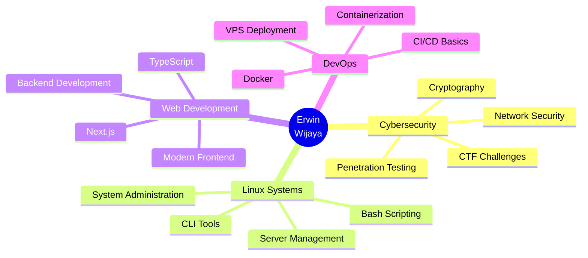

<div align="center">


<br/>

[](mailto:erwinwijaya6510@gmail.com)
[](https://linkedin.com/in/erwin-wijaya-b68b11299)
[](https://discord.gg/EfMsJTDf)


</div>

##  About Me

```python
class ErwinWijaya:
    def __init__(self):
        self.name = "Erwin Wijaya"
        self.role = "Cybersecurity Enthusiast & Informatics Student"
        self.location = "🇮🇩 Bandar Lampung, Indonesia"
        self.education = {
            "university": "Universitas Teknokrat Indonesia",
            "major": "Informatics Engineering",
            "period": "2024 - Present",
            "status": "🎓 Currently Learning & Growing"
        }
        
    def get_interests(self):
        return [
            "🔐 Cybersecurity & Ethical Hacking",
            "🚩 CTF Challenges & Problem Solving",
            "🐧 Linux Systems & Administration",
            "🌐 Web Development & Technologies",
            "🔍 Network Security & Analysis"
        ]
    
    def current_focus(self):
        return {
            "learning": ["Docker", "TypeScript", "Next.js", "Network Security"],
            "practicing": ["CTF Challenges", "Linux Scripting", "Web Development"],
            "exploring": ["Cryptography", "OSINT", "Packet Analysis"],
            "motto": "Every small bit of learning matters — it's still better than doing nothing!"
        }

erwin = ErwinWijaya()
print(erwin.current_focus())
```

<div align="center">

##  Tech Stack & Arsenal


### 🐧 Operating Systems & Environment

<p>


</p>

**Skills:** `Linux CLI & Scripting` `Ubuntu Development` `Kali Security Testing` `Bash Automation` `Terminal Power User`


### 🔐 Cybersecurity & Hacking Tools

<p>


</p>

**Arsenal:** `Packet Analysis` `Network Scanning` `Cryptography` `Digital Forensics` `Open Source Intelligence` `Vulnerability Research`


### 💻 Programming & Scripting Languages

<p>

</p>

**Proficiency:** `Python Automation` `JavaScript ES6+` `TypeScript` `HTML5` `CSS3` `PHP Backend`


### 🚀 Frameworks & Technologies

<p>

</p>

**Tools:** `Next.js` `Docker & Containerization` `Docker Compose` `Git Version Control` `VS Code` `VPS Deployment`


</div>

## 📊 GitHub Statistics & Activity

<div align="center">
  
  
</div>

<div align="center">
  
  
</div>

<div align="center">

## 🏆 GitHub Trophies


</div>

## 🎯 Current Learning Journey

<div align="center">



</div>

## 🔥 Contribution Snake

<div align="center">
  
</div>

## 💡 Random Dev Quote

<div align="center">


</div>

## 🎵 Currently Vibing To

<div align="center">

[](https://github.com/kittinan/spotify-github-profile)

</div>

---

<div align="center">

### 🌟 Profile Views Counter


### 📫 Let's Connect & Collaborate!


### 💭 Random Dev Fact


</div>
