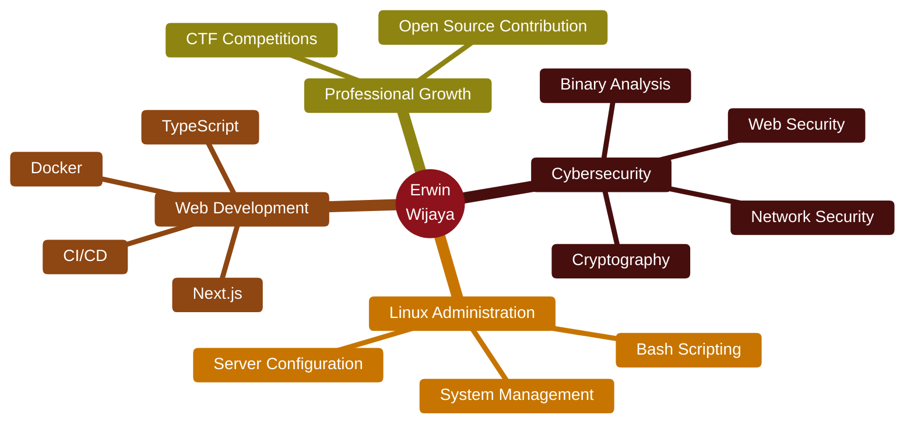

<div align="center">

# 🔥 ERWIN WIJAYA 🔥


[](mailto:erwinwijaya6510@gmail.com)
[](https://linkedin.com/in/erwin-wijaya-b68b11299)
[](https://discord.gg/EfMsJTDf)


---

### 👨‍💻 About Me

```typescript
const erwin = {
  education: "🎓 Informatics Engineering @ Universitas Teknokrat Indonesia",
  location: "📍 Bandar Lampung, Indonesia",
  status: "🌱 Currently Learning & Growing",
  interests: [
    "🔐 Cybersecurity & Ethical Hacking",
    "🚩 CTF Challenges",
    "🐧 Linux System Administration", 
    "🌐 Web Development",
    "🐳 Docker & DevOps"
  ],
  motto: "💡 Every line of code is a step forward!"
};
```

---

### 🛠️ Tech Arsenal

**Operating Systems**


**Programming**


**Frameworks & Tools**


---

### 🔐 Cybersecurity Skills

<details>
<summary><b>🌐 Web Exploitation</b></summary>
<br>

- SQL Injection & Database Security
- Cross-Site Scripting (XSS)
- Authentication & Session Management
- CSRF & Security Misconfigurations
- API Security Assessment

</details>

<details>
<summary><b>🔒 Cryptography</b></summary>
<br>

- Classical & Modern Cipher Systems
- Symmetric & Asymmetric Encryption
- Hash Functions & Digital Signatures
- Public Key Infrastructure (PKI)
- Cryptanalysis Techniques

</details>

<details>
<summary><b>💾 Binary Exploitation</b></summary>
<br>

- Memory Corruption Analysis
- Buffer Overflow Techniques
- Assembly Language Comprehension
- Reverse Engineering Fundamentals
- Debugger & Disassembler Usage

</details>

<details>
<summary><b>🛡️ Security Tools</b></summary>
<br>

- Network Traffic Analysis (Wireshark)
- Vulnerability Scanning (Nmap)
- Open Source Intelligence (OSINT)
- Digital Forensics & Incident Response
- Security Tool Development

</details>

---

### 📊 GitHub Stats

<picture>
  <source media="(prefers-color-scheme: dark)" srcset="https://github-readme-stats.vercel.app/api?username=Romm31&show_icons=true&theme=dark&hide_border=true&bg_color=0D1117&title_color=8B0000&icon_color=8B0000&text_color=C9D1D9&count_private=true&include_all_commits=true">
  
</picture>

<picture>
  <source media="(prefers-color-scheme: dark)" srcset="https://github-readme-streak-stats.herokuapp.com/?user=Romm31&theme=dark&hide_border=true&background=0D1117&stroke=8B0000&ring=8B0000&fire=DC143C&currStreakLabel=8B0000&sideLabels=8B0000&dates=C9D1D9">
  
</picture>

<picture>
  <source media="(prefers-color-scheme: dark)" srcset="https://github-readme-stats.vercel.app/api/top-langs/?username=Romm31&layout=compact&theme=dark&hide_border=true&bg_color=0D1117&title_color=8B0000&text_color=C9D1D9&langs_count=8">
  
</picture>

<picture>
  <source media="(prefers-color-scheme: dark)" srcset="https://github-readme-activity-graph.vercel.app/graph?username=Romm31&theme=github-compact&hide_border=true&bg_color=0D1117&color=8B0000&line=8B0000&point=DC143C&area=true&area_color=8B0000">
  
</picture>

---

### 🏆 GitHub Trophies


---

### 🎯 Learning Roadmap



---

### 💬 Connect With Me

> 📧 **Email:** erwinwijaya6510@gmail.com  
> 💼 **LinkedIn:** [Erwin Wijaya](https://linkedin.com/in/erwin-wijaya-b68b11299)  
> 💬 **Discord:** [Join My Server](https://discord.gg/EfMsJTDf)

---

<sub>⭐ From [Romm31](https://github.com/Romm31) | Made with ❤️ and lots of ☕</sub>

</div>
