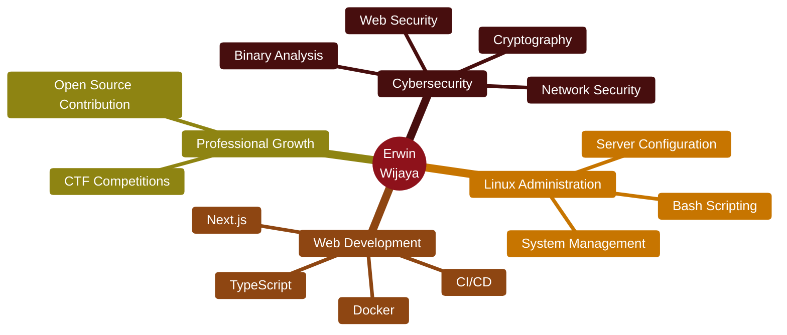

<div align="center">


<h3>
  
</h3>

<br/>

[](mailto:erwinwijaya6510@gmail.com)
[](https://linkedin.com/in/erwin-wijaya-b68b11299)
[](https://discord.gg/EfMsJTDf)


</div>

## 📋 Professional Summary


**Informatics Engineering Student** at Universitas Teknokrat Indonesia with a strong foundation in cybersecurity, Linux system administration, and software development. Passionate about ethical hacking, capture the flag competitions, and building secure, scalable applications.

### Current Focus Areas

- 🔐 **Cybersecurity Enthusiast** - Web exploitation, cryptography, and binary analysis
- 🐧 **Linux Systems** - Advanced system administration and automation
- 🌐 **Web Development** - Modern full-stack development with Next.js and TypeScript
- 🐳 **DevOps** - Containerization and infrastructure management
- 🚩 **CTF Player** - Continuous skill development through practical challenges

<br clear="right"/>


## 🎓 Education

**Universitas Teknokrat Indonesia** | *2024 - Present*  
Bachelor of Informatics Engineering  
📍 Bandar Lampung, Indonesia


## 💼 Technical Expertise

### 🐧 Operating Systems & Infrastructure

<p align="center">
  
  
  
  
  
</p>

**Core Competencies:**  
Advanced command-line operations • System administration • Shell scripting & automation • Server configuration & hardening • Process management • Network configuration


### 🔐 Cybersecurity Specializations

```python
#!/usr/bin/env python3
# Cybersecurity Domain Expertise

security_domains = {
    "Web Exploitation": {
        "skills": [
            "SQL Injection & Database Security",
            "Cross-Site Scripting (XSS)",
            "Authentication & Session Management",
            "CSRF & Security Misconfigurations",
            "API Security Assessment"
        ]
    },
    
    "Cryptography": {
        "skills": [
            "Classical & Modern Cipher Systems",
            "Symmetric & Asymmetric Encryption",
            "Hash Functions & Digital Signatures",
            "Public Key Infrastructure (PKI)",
            "Cryptanalysis Techniques"
        ]
    },
    
    "Binary Exploitation": {
        "skills": [
            "Memory Corruption Analysis",
            "Buffer Overflow Techniques",
            "Assembly Language Comprehension",
            "Reverse Engineering Fundamentals",
            "Debugger & Disassembler Usage"
        ]
    }
}

# Additional Security Tools & Techniques
security_tools = [
    "Network Traffic Analysis (Wireshark)",
    "Vulnerability Scanning (Nmap)",
    "Open Source Intelligence (OSINT)",
    "Digital Forensics & Incident Response",
    "Security Tool Development & Automation"
]
```


### 💻 Programming & Development

<p align="center">
  
  
  
  
  
  
</p>

**Development Proficiencies:**
- **Python** - Security automation, data analysis, scripting
- **JavaScript/TypeScript** - Modern web application development
- **HTML/CSS** - Responsive web design and user interfaces
- **PHP** - Server-side scripting and backend development


### 🚀 Frameworks & Tools

<p align="center">
  
  
  
  
  
  
</p>

**Technology Stack:**
- **Next.js** - React-based web framework for modern applications
- **Docker** - Container orchestration and deployment
- **Git/GitHub** - Version control and collaborative development
- **Development Environments** - VS Code, Vim


## 📊 GitHub Statistics

<div align="center">

### 📈 Performance Metrics

<table width="100%">
<tr>
<td align="center" width="50%">

</td>
<td align="center" width="50%">

</td>
</tr>
</table>

### 💻 Language Distribution & Contribution Activity

<table width="100%">
<tr>
<td align="center" width="50%">

</td>
<td align="center" width="50%">

</td>
</tr>
</table>

### 🔥 Annual Contribution Patterns


### 🏆 GitHub Achievements

<table width="100%">
<tr>
<td align="center">

</td>
</tr>
</table>

</div>


## 🎯 Current Learning Path

<div align="center">



</div>


## 📫 Professional Contact

<div align="center">

<table>
<tr>
<td align="center" width="33%">

### 📧 Email
[erwinwijaya6510@gmail.com](mailto:erwinwijaya6510@gmail.com)

</td>
<td align="center" width="33%">

### 💼 LinkedIn
[Erwin Wijaya](https://linkedin.com/in/erwin-wijaya-b68b11299)

</td>
<td align="center" width="33%">

### 💬 Discord
[Contact Me](https://discord.gg/EfMsJTDf)

</td>
</tr>
</table>

### 📈 Profile Analytics


</div>

---

<div align="center">


**© 2025 Erwin Wijaya** | *Committed to Excellence in Cybersecurity and Software Engineering*

</div>
