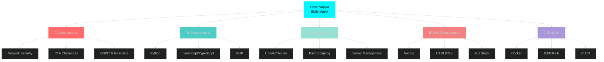

<div align="center">


<br/>

<table>
<tr>
<td align="center" width="33%">

<br/>
<a href="mailto:erwinwijaya6510@gmail.com">

</a>
</td>
<td align="center" width="33%">

<br/>
<a href="https://linkedin.com/in/erwin-wijaya-b68b11299">

</a>
</td>
<td align="center" width="33%">

<br/>
<a href="https://discord.gg/EfMsJTDf">

</a>
</td>
</tr>
</table>


</div>


##  ABOUT ME

```python
#!/usr/bin/env python3
# -*- coding: utf-8 -*-

class CyberWarrior:
    def __init__(self):
        self.name = "Erwin Wijaya"
        self.role = "Cybersecurity Enthusiast & Informatics Student"
        self.location = "🇮🇩 Bandar Lampung, Indonesia"
        self.status = "🎯 Hunting Bugs & Learning New Skills"
        
        self.education = {
            "university": "🏛️ Universitas Teknokrat Indonesia",
            "major": "💻 Informatics Engineering",
            "period": "2024 - Present",
            "achievement": "🎓 Growing & Evolving"
        }
        
        self.interests = [
            "🔐 Cybersecurity & Penetration Testing",
            "🚩 CTF Challenges & Competitive Hacking",
            "🐧 Linux/Unix Systems & Server Management",
            "🌐 Full Stack Web Development",
            "🔍 Network Analysis & Protocol Research",
            "🐳 Containerization & Cloud Technologies"
        ]
        
        self.daily_routine = {
            "morning": "☕ Coffee + Reading Security News",
            "afternoon": "💻 Coding & CTF Practice",
            "evening": "📚 Learning New Technologies",
            "night": "🔥 Building Personal Projects"
        }
    
    def get_current_mission(self):
        return {
            "🎯 Learning": ["Docker Orchestration", "Advanced TypeScript", "Next.js 15", "Kubernetes Basics"],
            "🛠️ Practicing": ["CTF Daily Challenges", "Linux Hardening", "API Development", "CI/CD Pipelines"],
            "🔬 Researching": ["Web3 Security", "Modern Cryptography", "OSINT Techniques", "Zero Trust Architecture"],
            "💪 Building": ["Personal Security Lab", "Automation Scripts", "Portfolio Projects", "Docker Images"],
            "💡 Motto": "Every line of code, every challenge solved, makes me 1% better than yesterday! 🚀"
        }

# Initialize the warrior
erwin = CyberWarrior()
print(f"Mission Status: {erwin.get_current_mission()}")
print("⚡ Let's hack the planet responsibly! ⚡")
```

<br clear="right"/>

<div align="center">

##  TECH STACK & ARSENAL


### 🐧 OPERATING SYSTEMS & ENVIRONMENTS

<table>
<tr>
<td align="center" width="120">

<br/><strong>Linux</strong>
</td>
<td align="center" width="120">

<br/><strong>Ubuntu</strong>
</td>
<td align="center" width="120">

<br/><strong>Debian</strong>
</td>
<td align="center" width="120">

<br/><strong>Kali Linux</strong>
</td>
<td align="center" width="120">

<br/><strong>Bash</strong>
</td>
</tr>
</table>

**💪 System Mastery:** `Advanced Linux CLI` `Ubuntu Desktop & Server` `Debian Stable Systems` `Kali Pentesting` `Bash Scripting & Automation` `Shell Power User` `System Administration` `Server Configuration`


### 🔐 CYBERSECURITY & HACKING ARSENAL

<table>
<tr>
<td align="center" width="150">

<br/><strong>Wireshark</strong>
</td>
<td align="center" width="150">

<br/><strong>Nmap</strong>
</td>
<td align="center" width="150">

<br/><strong>Cryptography</strong>
</td>
<td align="center" width="150">

<br/><strong>OSINT</strong>
</td>
<td align="center" width="150">

<br/><strong>Forensics</strong>
</td>
</tr>
</table>

**🎯 Security Skills:** `Network Packet Analysis` `Port Scanning & Enumeration` `Encryption & Decryption` `Digital Forensics` `Open Source Intelligence` `Vulnerability Assessment` `CTF Problem Solving` `Security Research`


### 💻 PROGRAMMING & SCRIPTING LANGUAGES

<table>
<tr>
<td align="center" width="120">

<br/><strong>Python</strong>
</td>
<td align="center" width="120">

<br/><strong>JavaScript</strong>
</td>
<td align="center" width="120">

<br/><strong>TypeScript</strong>
</td>
<td align="center" width="120">

<br/><strong>HTML5</strong>
</td>
<td align="center" width="120">

<br/><strong>CSS3</strong>
</td>
<td align="center" width="120">

<br/><strong>PHP</strong>
</td>
</tr>
</table>

**⚡ Coding Power:** `Python Automation & Security Scripts` `Modern JavaScript ES6+` `TypeScript Type Safety` `Semantic HTML5` `Responsive CSS3` `PHP Backend Development` `Algorithm Design` `Clean Code Practices`


### 🚀 FRAMEWORKS, TOOLS & TECHNOLOGIES

<table>
<tr>
<td align="center" width="120">

<br/><strong>Next.js</strong>
</td>
<td align="center" width="120">

<br/><strong>Docker</strong>
</td>
<td align="center" width="120">

<br/><strong>Git</strong>
</td>
<td align="center" width="120">

<br/><strong>GitHub</strong>
</td>
<td align="center" width="120">

<br/><strong>VS Code</strong>
</td>
<td align="center" width="120">

<br/><strong>Vim</strong>
</td>
</tr>
</table>

**🛠️ DevOps Arsenal:** `Next.js React Framework` `Docker Containerization` `Docker Compose Multi-Container` `Git Version Control` `GitHub Actions CI/CD` `VS Code IDE` `Vim Text Editor` `VPS Deployment` `Linux Server Management`


</div>

<div align="center">

## 📊 GITHUB STATISTICS & ANALYTICS


</div>

<table width="100%">
<tr>
<td width="50%" align="center">
  
</td>
<td width="50%" align="center">
  
</td>
</tr>
<tr>
<td width="50%" align="center">
  
</td>
<td width="50%" align="center">
  
</td>
</tr>
</table>

<div align="center">

### 🏆 GITHUB ACHIEVEMENTS & TROPHIES


## 🎯 SKILLS PROFICIENCY RADAR




## 🔥 CONTRIBUTION ACTIVITY


## 💎 CODING STATS & INSIGHTS

<table width="100%">
<tr>
<td width="50%">

**🌟 Profile Metrics**
- 🎯 CTF Problems Solved: Growing Daily
- 🔥 Commit Streak: Active
- 💻 Lines of Code: Thousands
- 📚 Repositories: Multiple Projects
- ⭐ GitHub Stars: Collecting
- 🤝 Collaborations: Open Source

</td>
<td width="50%">

**📈 Learning Progress**
- 🔐 Security: Intermediate → Advanced
- 🐧 Linux: Advanced User
- 💻 Programming: Multi-Language
- 🌐 Web Dev: Full Stack Journey
- 🐳 Docker: Container Expert Path
- 🚀 Overall: Constantly Evolving

</td>
</tr>
</table>


</div>

## 💡 INSPIRATIONAL TECH QUOTE

<div align="center">


</div>

## 🎵 CURRENTLY VIBING TO

<div align="center">

[](https://open.spotify.com/user/31l76oq4pqlvselt7fbjk6gddcfy)

</div>

---

<div align="center">

## 📈 PROFILE ANALYTICS

<table>
<tr>
<td align="center">

</td>
<td align="center">

</td>
<td align="center">

</td>
</tr>
</table>


### 🌐 LET'S CONNECT & BUILD SOMETHING EPIC!


<table>
<tr>
<td align="center">
<a href="mailto:erwinwijaya6510@gmail.com">

</a>
</td>
<td align="center">
<a href="https://linkedin.com/in/erwin-wijaya-b68b11299">

</a>
</td>
<td align="center">
<a href="https://discord.gg/EfMsJTDf">

</a>
</td>
</tr>
</table>


### 😄 RANDOM DEV HUMOR


### 🎯 FUN FACTS ABOUT ME

- 🔐 I debug with `console.log()` and I'm not ashamed!
- 🐧 My terminal is my second home
- ☕ Code + Coffee = Perfect Combo
- 🌙 Night owl programmer 🦉
- 🎮 CTF is my favorite game
- 💡 "It works on my machine" - Every developer ever
- 🚀 Learning something new every single day!


### ⚡ Made with 💙 and lots of ☕ by Erwin Wijaya ⚡

</div>
