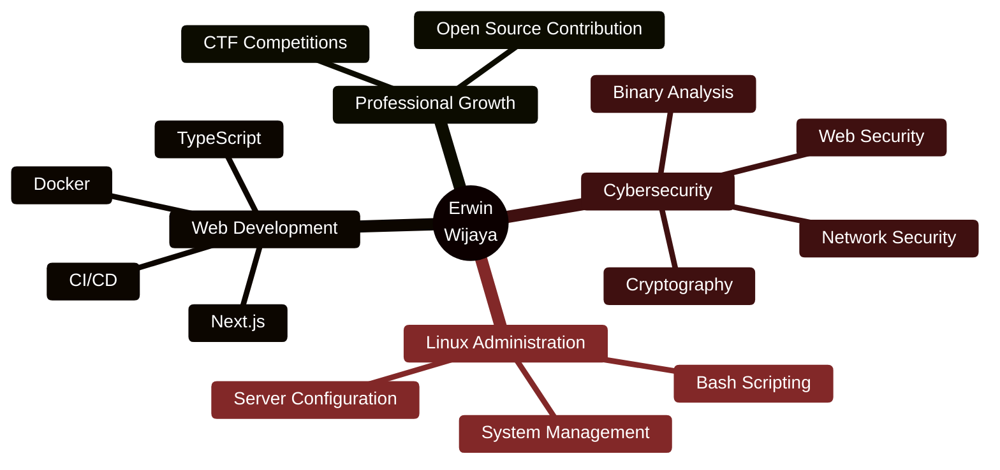

<div align="center">


<br/>

[](mailto:erwinwijaya6510@gmail.com)
[](https://linkedin.com/in/erwin-wijaya-b68b11299)
[](https://discord.gg/EfMsJTDf)


</div>

## 🎯 About Me

> **Informatics Engineering Student** @ Universitas Teknokrat Indonesia 🎓  
> 📍 Based in Bandar Lampung, Indonesia  
> 💡 Passionate about cybersecurity, Linux systems, and web development


### 🔥 Current Focus

- 🔐 **Cybersecurity** - Web exploitation, cryptography, binary analysis
- 🐧 **Linux Mastery** - System administration & automation
- 🌐 **Web Development** - Next.js, TypeScript, modern frameworks
- 🐳 **DevOps** - Docker containerization & infrastructure
- 🚩 **CTF Competitions** - Continuous learning through challenges

<br clear="right"/>

---

## 🛠️ Technology Stack

<div align="center">

### Operating Systems & Environments

[](#)
[](#)
[](#)
[](#)
[](#)

### Programming Languages

[](#)
[](#)
[](#)
[](#)
[](#)
[](#)

### Frameworks & Tools

[](#)
[](#)
[](#)
[](#)
[](#)
[](#)

</div>

---

## 🔐 Cybersecurity Expertise

<details open>
<summary><b>🌐 Web Exploitation</b></summary>

```python
web_exploitation = {
    "SQL Injection": "Database security testing & exploitation",
    "Cross-Site Scripting (XSS)": "Client-side vulnerability analysis",
    "Authentication Bypass": "Session management & access control",
    "CSRF": "Cross-site request forgery techniques",
    "API Security": "REST/GraphQL security assessment"
}
```

</details>

<details>
<summary><b>🔒 Cryptography</b></summary>

```python
cryptography = {
    "Classical Ciphers": "Caesar, Vigenère, substitution ciphers",
    "Modern Encryption": "AES, RSA, elliptic curve cryptography",
    "Hash Functions": "MD5, SHA family, bcrypt analysis",
    "PKI": "Public key infrastructure & digital signatures",
    "Cryptanalysis": "Breaking weak encryption implementations"
}
```

</details>

<details>
<summary><b>💾 Binary Exploitation</b></summary>

```python
binary_exploitation = {
    "Memory Corruption": "Stack & heap overflow vulnerabilities",
    "Buffer Overflow": "Control flow hijacking techniques",
    "Assembly": "x86/x64 assembly language analysis",
    "Reverse Engineering": "Binary analysis & decompilation",
    "Debugging": "GDB, radare2, IDA Pro usage"
}
```

</details>

<details>
<summary><b>🛡️ Security Tools & Techniques</b></summary>

```python
security_tools = {
    "Wireshark": "Network traffic analysis & packet inspection",
    "Nmap": "Port scanning & service enumeration",
    "OSINT": "Open source intelligence gathering",
    "Forensics": "Digital forensics & incident response",
    "Automation": "Security tool development with Python"
}
```

</details>

---

## 📊 GitHub Statistics

<div align="center">


</div>

### 🏆 GitHub Trophies

<div align="center">


</div>

### 📈 Contribution Graph

<div align="center">


</div>

---

## 🎯 Learning Roadmap

<div align="center">



</div>

---

## 📫 Let's Connect!

<div align="center">

| 💬 **Platform** | 🔗 **Link** |
|:---:|:---:|
| 📧 **Email** | [erwinwijaya6510@gmail.com](mailto:erwinwijaya6510@gmail.com) |
| 💼 **LinkedIn** | [Erwin Wijaya](https://linkedin.com/in/erwin-wijaya-b68b11299) |
| 🎮 **Discord** | [Join My Server](https://discord.gg/EfMsJTDf) |

### 💭 Quote of the Day

> *"The only way to do great work is to love what you do."* - Steve Jobs

</div>

---

<div align="center">


**⭐ From [Romm31](https://github.com/Romm31) with ❤️**  
*Made with passion, powered by coffee ☕*

</div>
